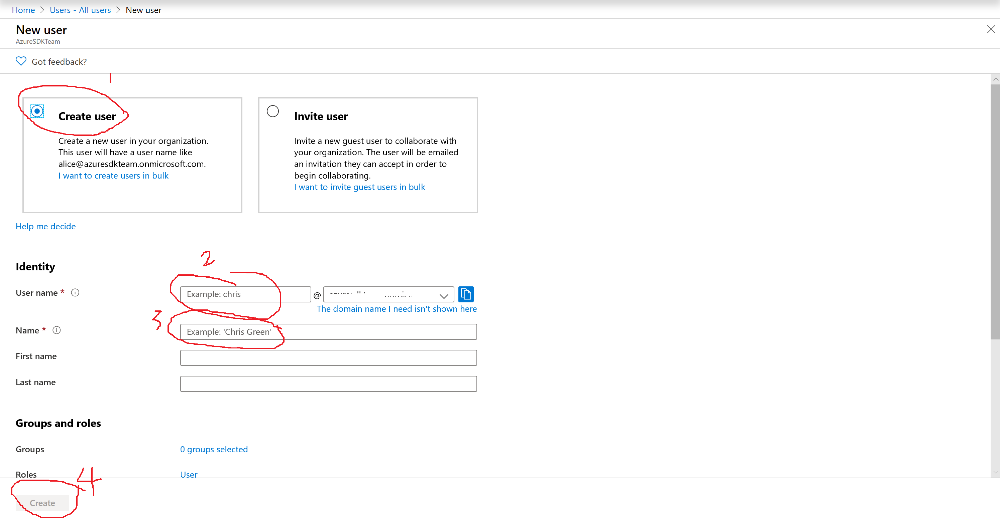

This document describes how to create a cloud only user and reset password.  

## Create Cloud Only User  
1. Go to Azure Portal  
2. Search Users  
3. Click All Users, click New user  
4. Input User name and Name  
5. Click Create  
  

## Reset Password
Please follow [Create and configure an Azure Active Directory Domain Services instance](https://docs.microsoft.com/en-us/azure/active-directory-domain-services/tutorial-create-instance), Enable user accounts for Azure AD DS, "For cloud-only user accounts..." to reset password.
  

